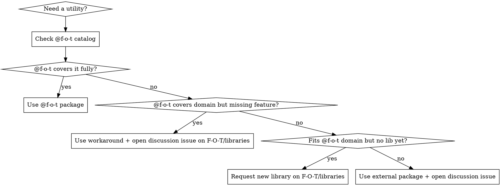

# @f-o-t/libraries

## Overview

The `F-O-T/libraries` monorepo is the **first place to check** before installing any external dependency. When a needed feature is missing, request it — don't import from npm.

**Core principle:** Enrich `@f-o-t` libraries instead of adding external dependencies. Even when you must use a workaround today, open an issue for discussion so the library grows.

## When to Use

**Always use this skill before:**

- Running `bun add <some-external-package>`
- Importing from a library not already in the project
- Needing utility functionality (QR codes, crypto, money, content, markdown, etc.)

**Also use when:**

- An `@f-o-t` library covers the domain but is missing a method → request the feature + open discussion issue
- An `@f-o-t` library has a bug → report it
- You find yourself writing a helper that logically belongs in `@f-o-t` → propose it

## Available Libraries

Check the root `package.json` catalog under `"fot"` for currently installed versions.

| Package                      | Domain                                      |
| ---------------------------- | ------------------------------------------- |
| `@f-o-t/qrcode`              | QR code generation as PNG `Uint8Array`      |
| `@f-o-t/money`               | BRL currency with scale 6 (micro-precision) |
| `@f-o-t/condition-evaluator` | Condition evaluation engine                 |
| `@f-o-t/content-analysis`    | Content analysis utilities                  |
| `@f-o-t/markdown`            | Markdown processing                         |
| `@f-o-t/spelling`            | Spelling utilities                          |
| `@f-o-t/crypto`              | PKCS#12, CMS/PKCS#7, hashing, PEM           |
| `@f-o-t/asn1`                | ASN.1 DER encoding/decoding                 |
| `@f-o-t/digital-certificate` | Brazilian A1 certificate handling           |
| `@f-o-t/e-signature`         | PAdES PDF signing (ICP-Brasil)              |

Discover all published packages:

```bash
npm search @f-o-t
gh repo view F-O-T/libraries
```

## Decision Flow



## Requesting a Feature (Missing Method/API)

**REQUIRED SUB-SKILL:** Use `feature-request` on repo `F-O-T/libraries`

```bash
gh issue create --repo F-O-T/libraries \
  --title "[package-name] Add <method/feature>" \
  --label "enhancement" \
  --body "..."
```

**What to include:**

- The exact API you need (method signature, input/output types)
- Your use case — why it belongs in `@f-o-t`
- Example usage showing what you want to call
- The workaround you're using in the meantime (if any)

**Example:**

```
Title: [@f-o-t/qrcode] Add browser-compatible dataURL helper

Use case: Profile 2FA TOTP setup needs to display QR in a React app.
generateQrCode() returns Uint8Array (Bun/server). Browser needs a data URL.

Desired API:
  import { qrCodeToDataUrl } from "@f-o-t/qrcode";
  const src = qrCodeToDataUrl(totpUri, { size: 180 });
  // returns "data:image/png;base64,..."

Workaround (current): btoa(String.fromCharCode(...generateQrCode(uri)))
```

## Opening a Discussion Issue (Enrichment Idea)

Even when you're using a workaround or an external package temporarily, **always open a discussion issue** if there's a clear enrichment opportunity for `@f-o-t`:

```bash
gh issue create --repo F-O-T/libraries \
  --title "[discussion] <domain> - <what could be added>" \
  --label "discussion" \
  --body "..."
```

Use this for:

- Workarounds you wrote inline that should be a proper API
- External packages you installed that could be replaced
- Patterns repeated across projects that belong in a shared lib

## Reporting a Bug

**REQUIRED SUB-SKILL:** Use `debug-and-report` on repo `F-O-T/libraries`

```bash
gh issue create --repo F-O-T/libraries \
  --title "[package-name] Bug: <what's broken>" \
  --label "bug"
```

## Red Flags — STOP Before Installing

| Thought                            | Action                                       |
| ---------------------------------- | -------------------------------------------- |
| "I need a QR code library"         | Check `@f-o-t/qrcode`                        |
| "I need a currency formatter"      | Check `@f-o-t/money`                         |
| "I'll just `bun add` this package" | Stop — check `@f-o-t` catalog first          |
| "This library is missing X method" | Request it + open discussion issue           |
| "I wrote a helper for this inline" | Open discussion issue to move it to `@f-o-t` |

## Installing an @f-o-t Package

1. Add to root `package.json` catalog under `"fot"`:
   ```json
   "@f-o-t/qrcode": "1.0.1"
   ```
2. Add to the app's `package.json` dependencies:
   ```json
   "@f-o-t/qrcode": "catalog:fot"
   ```
3. Run `bun install`
