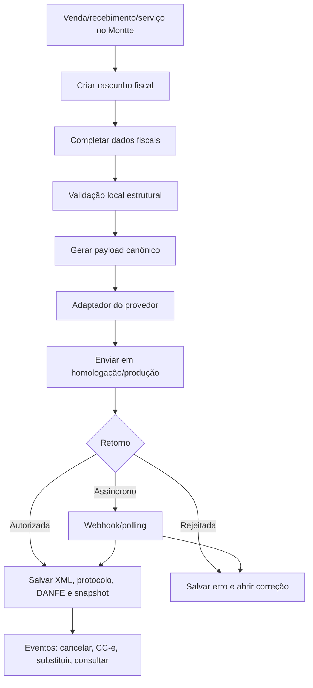
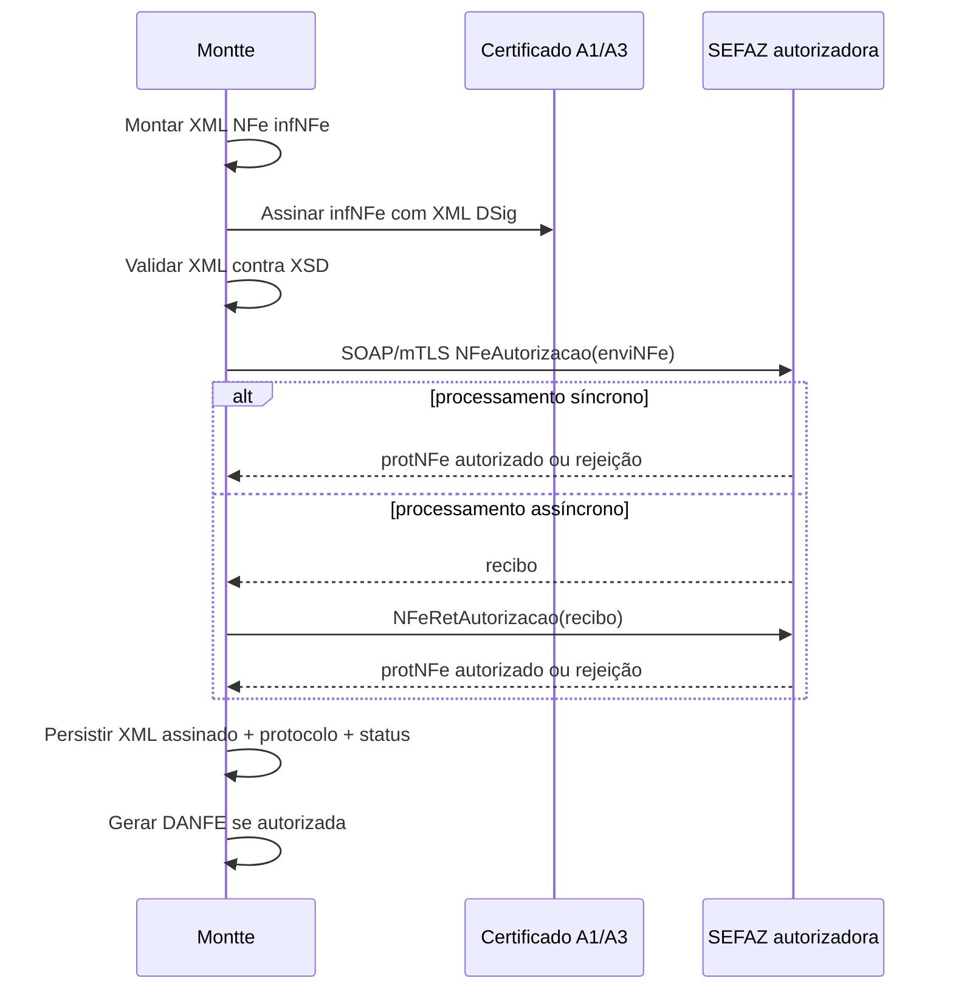

# Pesquisa e plano de dados para emissão futura de NF-e, NFC-e e NFS-e no Montte

Data: 2026-05-26  
Escopo: preparar arquitetura, dados e UX para emissão futura de **NF-e modelo 55**, **NFC-e modelo 65** e **NFS-e**, preservando o módulo **Relacionamentos** como cadastro operacional de contrapartes — não como CRM.

## 1. Resumo executivo

A emissão fiscal no Brasil exige modelar três camadas separadas:

1. **Cadastro operacional reutilizável**: empresa emitente, relacionamento/contraparte, endereços, produtos/serviços e parâmetros fiscais.
2. **Documento fiscal imutável por ciclo de vida**: rascunho, envio, autorização, rejeição, cancelamento, inutilização/substituição/eventos, XML/PDF e protocolos.
3. **Adaptadores por provedor ou governo**: cada API usa payload próprio, normalizações e eventos assíncronos, mas o domínio interno do Montte deve ser estável.

Recomendação principal:

- **Não expandir Relacionamentos para CRM**. Use `relationships.parties` como entidade simples de contraparte: cliente/fornecedor, pessoa/empresa, nome, documento, e-mail e telefone. Adicione dados fiscais mínimos como tabelas satélite versionáveis: endereços fiscais, inscrições, perfil fiscal e preferências de emissão. Atividades, funil, oportunidades, campanhas e histórico comercial ficam fora.
- Criar um domínio novo, por exemplo `fiscal`, com agregados próprios para `fiscal_documents`, `fiscal_document_events`, `fiscal_provider_accounts`, `fiscal_issuer_profiles`, `fiscal_products`, `fiscal_services` e `fiscal_addresses`.
- Para NF-e/NFC-e, o MOC 7.0 define campos estruturais que precisam existir no modelo interno: destinatário, endereço, itens com NCM/CFOP/unidade/quantidade/valor, impostos, pagamentos e transporte. Para NFS-e, suportar dois mundos: **padrão municipal/ABRASF** e **Sistema Nacional NFS-e/DPS**.
- Começar por um **núcleo fiscal sem emissão**: cadastros, validação, preview de payload, armazenamento de XML e auditoria. Depois integrar 1 provedor em homologação e só então emissão real.
- Provedor recomendado para piloto: **Nuvem Fiscal** se a prioridade for API REST/OpenAPI moderna e cobertura multi-documento; **Focus NFe** como alternativa madura e bastante documentada; **PlugNotas/TecnoSpeed** se o critério principal for cobertura/consultoria fiscal ampla. **Arquivei/Qive** deve ser tratado como ingestão/monitoramento fiscal, não como emissor principal.

## 2. Glossário mínimo

| Termo | Significado prático para o Montte |
|---|---|
| NF-e modelo 55 | Nota fiscal eletrônica de produtos/mercadorias. Exige destinatário completo na regra geral. |
| NFC-e modelo 65 | Nota fiscal de consumidor eletrônica. Mais voltada ao varejo; destinatário pode ser omitido em alguns cenários, mas pagamentos e QR Code são centrais. |
| NFS-e | Nota fiscal de serviço eletrônica. Historicamente municipal; hoje convive com ABRASF e Sistema Nacional NFS-e. |
| DPS | Declaração de Prestação de Serviço, documento de entrada usado pelo Sistema Nacional NFS-e para gerar NFS-e. |
| RPS | Recibo Provisório de Serviços, usado em integrações municipais/ABRASF para geração/conversão em NFS-e. |
| Emitente/prestador | Empresa do usuário Montte que emite o documento. Em NFS-e normalmente é o prestador. |
| Destinatário | Pessoa/empresa que recebe mercadoria/produto na NF-e/NFC-e. |
| Tomador | Pessoa/empresa que toma o serviço na NFS-e. |
| CFOP | Código Fiscal de Operações e Prestações; item obrigatório em produtos NF-e/NFC-e. |
| NCM | Nomenclatura Comum do Mercosul; obrigatória para mercadorias, com exceções para itens de serviço/sem produto no MOC. |
| CEST | Código Especificador da Substituição Tributária; condicional conforme mercadoria/regime. |
| CC-e | Carta de Correção Eletrônica; evento para correções formais, não substitui cancelamento nem altera dados fiscais essenciais. |
| Inutilização | Evento para inutilizar numeração não usada de NF-e/NFC-e. Não é cancelamento de nota autorizada. |
| Protocolo | Recibo/autorização/rejeição retornado pelo Fisco/provedor; deve ser armazenado com o XML. |
| DANFE/DANFCE | Documento auxiliar em PDF/impresso; representação, não substitui XML autorizado. |

## 3. Observações separadas de inferências


### Atualização importante: “padrão único” em 2026

- **NF-e/NFC-e**: já operam há anos com **leiaute nacional padronizado** e Portal NF-e nacional, mas a autorização ainda é distribuída por SEFAZ/autorizadores estaduais ou virtuais. Portanto, para o Montte, existe um padrão único de XML/schema/eventos, mas não um único endpoint operacional.
- **NFS-e**: o Brasil está migrando para o **padrão nacional da NFS-e**. Em 2026, fontes oficiais indicam adesão praticamente nacional de municípios e obrigatoriedade do Emissor Nacional para ME/EPP optantes do Simples Nacional a partir de 01/09/2026. Ainda assim, para produto ERP, é prudente manter camada adaptadora porque podem existir transições municipais, cenários fora do Simples, APIs/ambientes distintos e provedores que abstraem o padrão nacional.

Implicação arquitetural: tratar NFS-e Nacional como caminho principal novo, mas não apagar suporte a integrações municipais/provedores enquanto houver legado e exceções operacionais.


### Observações verificadas em fontes oficiais/documentação

- O MOC 7.0 Anexo I afirma que `dest` é obrigatório para **NF-e modelo 55** e que `xNome`/`enderDest` são obrigatórios para NF-e e opcionais/condicionais para NFC-e. O mesmo trecho lista `CNPJ`, `CPF` ou `idEstrangeiro`, endereço do destinatário e `indIEDest`.
- O MOC 7.0 lista campos obrigatórios de item como `cProd`, `xProd`, `NCM`, `CFOP`, `uCom`, `qCom`, `vUnCom` e `vProd`; `CEST`, `cBenef`, fabricante e outros campos são condicionais.
- O MOC 7.0 define `transp/modFrete` como grupo/campo obrigatório e permite `9=Sem Ocorrência de Transporte`.
- O MOC 7.0 define grupo de pagamento `pag/detPag` obrigatório para NF-e/NFC-e, com `tPag`, `vPag` e dados de cartão condicionais.
- O ABRASF 2.04 modela tomador com CPF/CNPJ, razão social, endereço nacional ou exterior e contato; dados de serviço incluem valores, ISS retido, item da lista de serviço, CNAE/código municipal opcionais, discriminação e município da prestação.
- O manual atual do Sistema Nacional NFS-e para contribuintes descreve APIs de parâmetros municipais, NFS-e via recepção de XML da DPS, consulta por chave de acesso, consulta de DPS e eventos. Ele destaca que parâmetros municipais e cadastros nacionais/CPF/CNPJ/Simples Nacional participam da validação da DPS.
- Documentações de provedores mostram abstrações próprias: Nuvem Fiscal, Focus NFe, PlugNotas, eNotas e WebmaniaBR aceitam JSON/REST para emissão; Arquivei/Qive aparece principalmente como API de consulta/monitoramento/distribuição, não como emissão.

### Inferências de arquitetura

- O Montte deve guardar **o suficiente para gerar ou regenerar payload fiscal**, mas não deve tentar reproduzir todo o MOC como colunas relacionais de primeira classe. Campos raros/condicionais devem ficar em JSONB versionado por documento/perfil, com campos críticos indexados.
- O documento fiscal autorizado deve ser tratado como **registro contábil/fiscal imutável**: correções posteriores entram como eventos, não como update destrutivo.
- Provedores simplificam payloads, mas o modelo interno deve manter distinções legais: cancelamento, inutilização, substituição e carta de correção não são a mesma operação.

## 4. Matriz de campos obrigatórios e recomendados

Legenda: **Legal** = exigido/derivado do MOC/ABRASF/Sistema Nacional; **Provedor** = prática comum de APIs; **Montte** = recomendação de modelagem.

### 4.1 Contraparte: Relacionamento, destinatário e tomador

| Campo Montte | NF-e 55 | NFC-e 65 | NFS-e | Origem | Recomendação |
|---|---:|---:|---:|---|---|
| `party.id` | recomendado | opcional | recomendado | Montte | Referência operacional; documento fiscal deve copiar snapshot. |
| Nome/razão social | obrigatório (`xNome`) | opcional/condicional | obrigatório (`RazaoSocial` tomador em ABRASF quando informado) | Legal | Em Relacionamentos, `name`; no documento, snapshot. |
| Tipo pessoa/empresa | necessário para CPF/CNPJ | necessário se identificado | necessário | Legal | Manter `kind=person/company`. |
| CPF/CNPJ | obrigatório para NF-e nacional, ou `idEstrangeiro` exterior | opcional conforme cenário de consumidor | CPF/CNPJ tomador quando identificado | Legal | `document_number`; permitir nulo para consumidor não identificado e estrangeiro em campo próprio. |
| Identificação estrangeira | exterior | exterior | NIF/endereço exterior | Legal | Não forçar CPF/CNPJ. Criar `foreign_identifier`. |
| Inscrição Estadual | condicional | não informar na NFC-e quando `indIEDest=9` | não central | Legal | Satélite fiscal, não campo principal de Relacionamentos. |
| Indicador IE (`indIEDest`) | obrigatório | regra específica NFC-e | n/a | Legal | Derivar de perfil fiscal, mas permitir override por documento. |
| Inscrição Municipal | n/a | n/a | relevante para prestador/tomador/intermediário em municípios | Legal/provedor | Satélite fiscal por município. |
| E-mail | opcional | opcional | contato opcional | Legal/provedor | Útil para envio de PDF/XML; não deve virar atividade CRM. |
| Telefone | opcional | opcional | contato opcional | Legal/provedor | Campo simples. |

### 4.2 Endereço fiscal

| Campo | NF-e 55 destinatário | NFC-e 65 | NFS-e tomador | Origem | Recomendação |
|---|---:|---:|---:|---|---|
| Logradouro | obrigatório no `enderDest` | condicional | obrigatório no endereço nacional ABRASF | Legal | `fiscal_addresses.street`. |
| Número | obrigatório | condicional | obrigatório | Legal | Aceitar `S/N` se permitido pelo provedor/município. |
| Complemento | opcional | opcional | opcional | Legal | Texto curto. |
| Bairro | obrigatório | condicional | obrigatório | Legal | Normalizar, mas não bloquear rascunho cedo. |
| Código município IBGE | obrigatório | condicional | obrigatório | Legal | Campo crítico; integrar tabela IBGE. |
| Município | obrigatório | condicional | derivável, mas aparece em payloads | Legal/provedor | Armazenar nome snapshot. |
| UF | obrigatório | condicional | obrigatório | Legal | Enum UF + `EX`/exterior quando aplicável. |
| CEP | opcional no MOC, frequentemente exigido na prática | frequentemente exigido se endereço | comum | Legal/provedor | Validar como recomendado; não prender Relacionamentos. |
| País/código BACEN/IBGE | exterior/condicional | condicional | exterior/condicional | Legal | Criar campos de país normalizados. |

### 4.3 Item de produto NF-e/NFC-e

| Campo | Obrigatoriedade | Origem | Modelagem Montte |
|---|---|---|---|
| Código interno `cProd` | obrigatório | Legal | `fiscal_product.sku/code`; snapshot por item. |
| Descrição `xProd` | obrigatório | Legal | Descrição fiscal separada da descrição comercial. |
| GTIN/EAN `cEAN` | obrigatório com `SEM GTIN` quando não houver | Legal | Campo nullable + fallback explícito. |
| NCM | obrigatório, 8 dígitos na regra geral | Legal | Catálogo fiscal do produto; validação por item. |
| CEST | condicional | Legal | Campo fiscal opcional com regras por NCM/UF/regime. |
| CFOP | obrigatório | Legal | Escolha assistida por operação, UF e finalidade. |
| Unidade comercial `uCom` | obrigatório | Legal | Tabela de unidades; snapshot. |
| Quantidade `qCom` | obrigatório | Legal | Decimal com escala configurável. |
| Valor unitário `vUnCom` | obrigatório | Legal | Decimal alta precisão. |
| Valor produto `vProd` | obrigatório | Legal | Derivado, mas armazenado snapshot. |
| Impostos ICMS/IPI/PIS/COFINS/etc. | obrigatórios/condicionais conforme CST/CSOSN/regime/operação | Legal | Não tentar automatizar tudo no MVP; permitir cálculo por provedor e persistir retorno. |
| Benefício fiscal `cBenef` | condicional por UF | Legal | JSONB/regra estadual, não campo obrigatório global. |

### 4.4 Serviço NFS-e

| Campo | Obrigatoriedade | Origem | Modelagem Montte |
|---|---|---|---|
| Valor do serviço | obrigatório | ABRASF/SNNFS-e | `service_line.gross_amount`. |
| ISS retido | obrigatório no ABRASF `IssRetido` | ABRASF | Boolean/enum + responsável retenção. |
| Item Lista Serviço LC 116 | obrigatório | ABRASF | Catálogo fiscal de serviço. |
| CNAE | opcional/condicional | ABRASF/provedor/município | Perfil fiscal do serviço/prestador. |
| Código tributação municipal | opcional/condicional | ABRASF/município | Parametrizável por município. |
| Discriminação | obrigatório | ABRASF | Texto fiscal, separado de descrição interna. |
| Município prestação | obrigatório | ABRASF | Código IBGE. |
| Município incidência | opcional/condicional | ABRASF/SNNFS-e | Campo separado; não assumir igual ao tomador. |
| Alíquota/ISS/retencões PIS/COFINS/INSS/IR/CSLL | opcionais/condicionais | ABRASF/município | Campos numéricos snapshot + cálculo assistido. |
| DPS id/chave acesso | Sistema Nacional | SNNFS-e | Guardar identificador DPS e chave NFS-e. |

### 4.5 Pagamento e transporte NF-e/NFC-e

| Campo | NF-e | NFC-e | Origem | Recomendação |
|---|---:|---:|---|---|
| Forma pagamento `tPag` | obrigatório | obrigatório | Legal | Mapear de contas/recebimentos para códigos fiscais. |
| Valor pagamento `vPag` | obrigatório | obrigatório | Legal | Suportar múltiplos pagamentos. |
| Indicador à vista/prazo | opcional/legado em grupo pagamento | comum | Legal | Derivar de condições de pagamento. |
| Dados cartão/integração | condicional | frequente | Legal/provedor | Só pedir quando `tPag` cartão e provedor exigir. |
| Modalidade frete `modFrete` | obrigatório | obrigatório no grupo transp | Legal | Default explícito `9=Sem Ocorrência de Transporte` quando aplicável. |
| Transportadora | condicional | incomum | Legal | Relacionamento com role supplier/carrier opcional, sem CRM. |
| Volumes/peso/veículo | condicional | raro | Legal | JSONB/estrutura opcional por operação. |

## 5. Modelo de dados proposto

### 5.1 Princípios

1. **Snapshot fiscal**: documento fiscal não depende de dados vivos de relacionamento/produto após autorização.
2. **Cadastro mínimo, extensão fiscal separada**: Relacionamentos continua simples; dados fiscais ficam em tabelas satélite.
3. **Provider-agnostic core, provider-specific edge**: payload interno canônico + adaptadores.
4. **Eventos como append-only**: rejeição, autorização, cancelamento, CC-e, inutilização, substituição e webhooks são linhas novas.
5. **Sem promessa de cálculo tributário total no MVP**: início com validação estrutural e delegação ao provedor; evoluir regras próprias conforme necessidade.

### 5.2 Extensões sobre Relacionamentos sem CRM

Atual observado no repositório: `relationships.parties` possui `team_id`, `role` (`customer`/`supplier`), `kind` (`person`/`company`), `name`, `document_number`, `email`, `phone`, `archived_at`, timestamps e vínculo opcional com transações financeiras.

Adicionar satélites, não poluir a tabela principal:

```text
relationships.parties
  └─ fiscal.party_profiles
       party_id
       taxpayer_type              -- contribuinte ICMS, isento, não contribuinte
       state_registration
       municipal_registration
       suframa_registration
       foreign_identifier
       default_email_for_fiscal_docs
       notes_for_fiscal_use       -- texto operacional, não CRM

  └─ fiscal.party_addresses
       party_id
       purpose                    -- billing, delivery, service_taker, fiscal
       street, number, complement, district
       city_ibge_code, city_name, state, postal_code
       country_code, country_name
       exterior_address_text
       is_default
       valid_from, valid_to
```

O que **não** entra em Relacionamentos: pipeline de vendas, tarefas, lembretes comerciais, campanha, lead scoring, timeline de interações, ownership comercial. A única “timeline” fiscal deve estar no documento/eventos fiscais.

### 5.3 Domínio `fiscal`

Sugestão de tabelas principais:

```text
fiscal.issuer_profiles
  id, team_id
  legal_name, trade_name, document_number
  state_registration, municipal_registration
  tax_regime                  -- simples, normal, mei etc. (conforme necessidade)
  address_snapshot/jsonb
  certificate_ref             -- referência segura, não o PFX em claro
  provider_account_id
  environment                 -- homologation, production
  created_at, updated_at

fiscal.provider_accounts
  id, team_id
  provider                    -- nuvem_fiscal, focus_nfe, plugnotas, enotas, webmania, custom
  environment
  credentials_secret_ref
  capabilities_json           -- nfe, nfce, nfse, cancel, inutilizacao, cce, webhooks
  status

fiscal.document_series
  id, team_id, issuer_profile_id
  model                       -- 55, 65, nfse
  series, next_number
  environment
  provider_external_config

fiscal.documents
  id, team_id
  model                       -- nfe_55, nfce_65, nfse
  direction                   -- issued, received (future)
  issuer_profile_id
  party_id nullable
  status                      -- draft, validating, submitted, authorized, rejected, cancelled, denied, inutilized
  operation_type/finality
  issue_datetime, competence_date
  number, series
  access_key nullable
  provider, provider_document_id, provider_reference
  totals_jsonb
  canonical_payload_jsonb
  provider_payload_jsonb
  authorized_xml_file_id
  danfe_pdf_file_id
  rejection_reason
  created_at, updated_at

fiscal.document_parties
  document_id
  role                        -- issuer, recipient, taker, carrier, intermediary, authorized_xml
  party_id nullable
  snapshot_jsonb              -- nome, documento, endereço, inscrições, contato

fiscal.document_items
  id, document_id, line_number
  kind                        -- product, service
  product_id/service_id nullable
  description
  quantity, unit, unit_price, gross_amount, discount_amount
  fiscal_codes_jsonb          -- NCM, CEST, CFOP, CST/CSOSN, itemListaServico, CNAE, etc.
  taxes_jsonb

fiscal.document_payments
  id, document_id
  method_code                 -- tPag
  amount
  integration_type
  card_jsonb

fiscal.document_transport
  document_id
  freight_mode                -- modFrete
  carrier_party_id nullable
  snapshot_jsonb
  volumes_jsonb

fiscal.document_events
  id, document_id nullable
  event_type                  -- submit, authorization, rejection, cancellation, cce, inutilization, substitution, webhook
  status
  protocol_number
  event_datetime
  provider_event_id
  request_payload_jsonb
  response_payload_jsonb
  xml_file_id nullable
  error_code, error_message
  created_at
```

### 5.4 Catálogos fiscais mínimos

```text
fiscal.products
  id, team_id
  name, fiscal_description
  sku, gtin
  ncm, cest nullable
  default_unit
  default_cfop_by_context jsonb
  tax_profile_id nullable

fiscal.services
  id, team_id
  name, fiscal_description
  lc116_item_code
  cnae nullable
  municipal_tax_code nullable
  default_city_ibge_code nullable
  iss_retained_default nullable
  tax_profile_id nullable

fiscal.tax_profiles
  id, team_id
  applies_to -- product/service/issuer
  regime_context
  rules_jsonb
  source_notes
```

## 6. Arquitetura de emissão

### 6.1 Fluxo canônico



### 6.2 Adaptador de provedor

Interface interna sugerida:

```ts
type FiscalProvider = {
  capabilities(): ProviderCapabilities;
  validate?(document: CanonicalFiscalDocument): ValidationResult[];
  issue(document: CanonicalFiscalDocument): Promise<ProviderIssueResult>;
  getStatus(reference: string): Promise<ProviderStatusResult>;
  cancel(input: CancelInput): Promise<ProviderEventResult>;
  correct?(input: CorrectionLetterInput): Promise<ProviderEventResult>;
  inutilize?(input: InutilizationInput): Promise<ProviderEventResult>;
  replaceNfse?(input: NfseReplacementInput): Promise<ProviderIssueResult>;
};
```

A camada de aplicação não deve conhecer nomes de campos específicos de Nuvem Fiscal/Focus/PlugNotas. Ela conhece `CanonicalFiscalDocument`; adaptadores conhecem conversões.

### 6.3 Arquivos e auditoria

Guardar:

- XML assinado/autorizado.
- XML de cancelamento/eventos quando houver.
- DANFE/DANFCE/PDF/NFS-e PDF quando gerado.
- Payload canônico Montte.
- Payload enviado ao provedor.
- Resposta completa do provedor.
- Hashes dos arquivos para auditoria.

## 7. UX recomendada

### 7.1 Relacionamentos

Manter tela simples:

- Nome, tipo, cliente/fornecedor, documento, e-mail, telefone.
- Card “Dados fiscais” colapsado: inscrição estadual, inscrição municipal, indicador IE, endereços fiscais.
- Copy sugerida: “Esses dados são usados para notas fiscais e pagamentos. O Montte não transforma Relacionamentos em CRM.”

### 7.2 Produto/serviço

- Produto: aba “Fiscal” com NCM, CEST, GTIN, unidade, CFOP padrão e perfil tributário.
- Serviço: item LC 116, CNAE, código municipal, discriminação fiscal padrão, município padrão de prestação.
- Validar em níveis: “faltando para salvar cadastro” vs “faltando para emitir nota”. Não bloquear cadastro por ausência de campos fiscais avançados.

### 7.3 Emissão

Wizard mínimo:

1. Tipo de nota: NF-e, NFC-e, NFS-e.
2. Emitente/série/ambiente.
3. Cliente/tomador/destinatário.
4. Itens e tributação.
5. Pagamento/transporte, quando aplicável.
6. Revisão com alertas legais e alertas do provedor separados.
7. Emitir ou salvar rascunho.

Separar mensagens:

- **Regra legal**: “NF-e modelo 55 exige endereço do destinatário.”
- **Regra do provedor**: “Este provedor exige CEP para este município.”
- **Qualidade de cadastro**: “Adicionar e-mail permite enviar XML automaticamente.”

### 7.4 Estados de erro

- Rejeição fiscal: mostrar código, mensagem, campo provável, link para editar rascunho/clonar nota.
- Erro de provedor: mostrar status operacional e opção de tentar novamente.
- Erro de certificado/configuração: direcionar para perfil do emitente.
- Nota autorizada: bloquear edição destrutiva; oferecer eventos permitidos.

## 8. Plano incremental

### Fase 0 — Fundação sem emissão

- Criar domínio `fiscal` e tabelas satélite.
- Adicionar endereços fiscais e perfis fiscais de relacionamento.
- Criar catálogos básicos de produto/serviço.
- Criar `fiscal.documents` em modo rascunho com payload canônico.
- Implementar validações estruturais locais para campos mínimos.

Critério de saída: gerar preview JSON canônico para NF-e/NFC-e/NFS-e sem chamar provedor.

### Fase 1 — Provedor único em homologação

- Escolher Nuvem Fiscal ou Focus NFe para piloto.
- Implementar `FiscalProvider` para NF-e 55 em homologação.
- Persistir request/response/XML/protocolo.
- Implementar polling/webhook de status.

Critério de saída: emitir nota de homologação autorizada e uma rejeitada, com rastreabilidade completa. **Não há resultado executado nesta pesquisa; isto é critério futuro.**

### Fase 2 — Eventos de NF-e/NFC-e

- Cancelamento.
- Carta de correção.
- Inutilização de numeração.
- Consulta de status.
- NFC-e com pagamento, QR Code e DANFCE.

Critério de saída: ciclo de vida completo em homologação.

### Fase 3 — NFS-e

- Começar com 1 cidade/regime/provedor ou Sistema Nacional em produção restrita, conforme disponibilidade.
- Modelar DPS/RPS internamente.
- Implementar parâmetros municipais quando provedor/governo suportar.
- Implementar substituição/cancelamento/consulta.

Critério de saída: emitir NFS-e homologada para município-alvo ou ambiente nacional disponível.

### Fase 4 — Multi-provedor e robustez

- Adicionar segundo provedor para reduzir lock-in.
- Criar matriz de compatibilidade por documento/evento.
- Monitoramento de filas, webhooks, retries idempotentes.
- Alertas de certificado vencendo e série/numeração.

## 9. Comparativo de provedores fiscais

| Provedor | Evidência encontrada | Pontos fortes | Riscos/limites | Papel recomendado |
|---|---|---|---|---|
| Nuvem Fiscal | Documentação diz oferecer API REST para NF-e, NFC-e, NFS-e, certificados, XML, cancelamento, carta de correção, manifestação e Distribuição DF-e. OpenAPI/documentação lista configurações por empresa e endpoints de XML/cancelamento/inutilização. | API moderna, ampla cobertura, boa aderência a arquitetura provider-agnostic. | Validar preço, SLA, municípios NFS-e, webhooks e qualidade de SDK antes de contrato. | Melhor candidato para piloto técnico. |
| Focus NFe | Docs afirmam emissão/consulta de NFe, NFSe, NFCe via JSON simplificado; páginas específicas para cancelamento, CC-e, inutilização de NFC-e e eventos. | Maduro, documentação objetiva, reduz complexidade de assinatura/comunicação SEFAZ/prefeituras. | Payload simplificado pode esconder detalhes; avaliar lock-in e cobertura NFS-e nacional/municipal. | Alternativa forte ao piloto. |
| PlugNotas/TecnoSpeed | Central diz API REST JSON para NFSe, NFSe Nacional, NFe, NFCe, MDFe, CFe; docs para padrão NFS-e Nacional e Postman público. | Ecossistema fiscal amplo e suporte consultivo. | Documentação pública às vezes dispersa/dinâmica; integração pode depender de suporte/plano. | Bom para empresas que valorizam suporte fiscal amplo. |
| eNotas | Docs v2 cobrem NF-e/NFC-e; portal enfatiza NFS-e, webhooks, status, cadastro de empresa e características municipais por IBGE. | Forte em NFS-e e automação por município; boa experiência de desenvolvedor. | Verificar profundidade para NF-e/NFC-e e eventos avançados no plano pretendido. | Candidato se NFS-e for prioridade. |
| WebmaniaBR | Docs REST para NF-e, NFC-e, CC-e, MDe e API separada NFS-e; changelog e SDKs públicos. | Simplicidade REST, cobertura de emissão e monitor fiscal. | Avaliar robustez para casos fiscais complexos e ambientes multiempresa. | Alternativa pragmática para MVP simples. |
| Arquivei/Qive | Swagger/API Lite foca buscar XML por chave; central descreve monitoramento de documentos fiscais emitidos contra CNPJ e NFS-e Portal Nacional. | Excelente para consulta, recebidos, distribuição e monitoramento fiscal. | Não é emissor principal conforme evidência desta pesquisa. | Integrar futuramente para inbound/consulta, não para emissão. |
| NFE.io | Apareceu na busca como API de emissão NF-e/NFC-e/NFS-e, certificados, webhooks e consultas. | Pode ser candidato adicional. | Não estava no conjunto inicial analisado profundamente. | Avaliar em rodada posterior se necessário. |


## 10. Implementar NF-e hoje usando apenas certificado digital, sem provedor fiscal

Esta seção descreve a alternativa “direta SEFAZ”: o Montte assina XML, abre conexão mTLS com o Web Service da SEFAZ/autorizador da UF e conversa em SOAP/XML. É viável, mas aumenta muito o escopo: o provedor deixa de fazer assinatura, schemas, contingência, atualização de Notas Técnicas, retries, webhooks e interpretação de rejeições.

### 10.1 O que o certificado digital resolve — e o que não resolve

O certificado digital A1/A3 do emitente resolve duas obrigações técnicas centrais:

1. **Autenticação do canal TLS/mTLS**: a conexão HTTPS com os Web Services exige certificado cliente.
2. **Assinatura digital do XML**: a NF-e tem grupo de assinatura XML DSig; a validade jurídica depende da assinatura digital do emitente e da autorização de uso.

Ele **não** resolve sozinho:

- cálculo de impostos;
- montagem correta do XML no leiaute vigente;
- validação XSD;
- numeração/série/contingência;
- escolha do endpoint por UF, ambiente e modelo;
- tratamento de rejeições;
- armazenamento legal de XML/protocolo;
- DANFE;
- atualização contínua conforme Notas Técnicas.

### 10.2 Componentes mínimos

| Componente | Função | Observação para Montte |
|---|---|---|
| Cofre de certificado | Guardar A1 `.pfx/.p12` e senha com criptografia/secret manager | Evitar persistir senha em coluna comum. A3/token é muito mais difícil para SaaS web. |
| Gerador de XML NF-e 4.00 | Montar `NFe/infNFe` conforme schemas oficiais | Deve partir do payload canônico do domínio `fiscal`. |
| Assinador XML DSig | Assinar `infNFe` com canonicalização correta | Preservar IDs, namespaces e ordem dos elementos. |
| Validador XSD | Validar XML antes de enviar | Baixar/versionar pacote de schemas oficiais. |
| Cliente SOAP 1.2 + mTLS | Chamar Web Services SEFAZ | Endpoints variam por UF, ambiente e autorizador/SVRS/SVAN/SVC. |
| Orquestrador de lote | Enviar `enviNFe`, consultar recibo quando assíncrono | Suportar síncrono e assíncrono. |
| Persistência fiscal | XML assinado, XML protocolado, recibo, protocolo, status, eventos | Append-only, sem update destrutivo. |
| DANFE | Gerar PDF a partir do XML autorizado | Não é documento fiscal principal; XML é. |
| Motor de eventos | Cancelamento, CC-e, inutilização, consulta protocolo/status | Eventos também usam XML assinado e SOAP. |

### 10.3 Web Services essenciais da NF-e

Os nomes e URLs concretos devem vir da relação oficial de Web Services do Portal NF-e por UF/autorizador. Conceitualmente, o MVP direto precisa de:

| Serviço | Uso | Entrada/saída típica |
|---|---|---|
| `NFeStatusServico` | Verificar disponibilidade do autorizador | Consulta simples antes de emitir ou para healthcheck. |
| `NFeAutorizacao` | Enviar lote de NF-e | Envia `enviNFe_v4.00`; retorna autorização síncrona ou recibo. |
| `NFeRetAutorizacao` | Consultar processamento de lote assíncrono | Usa número do recibo; retorna protocolo/autorização/rejeição. |
| `NFeConsultaProtocolo` | Consultar situação por chave de acesso | Útil para recuperar status/protocolo. |
| `NFeRecepcaoEvento` / `RecepcaoEvento` | Registrar eventos | Cancelamento, CC-e e outros eventos. |
| `NFeInutilizacao` | Inutilizar faixa de numeração | Para números não usados, não para nota autorizada. |
| `NfeConsultaCadastro` | Consulta cadastral, quando disponível | Auxiliar; disponibilidade varia. |

### 10.4 Fluxo de autorização direta



### 10.5 Geração da chave de acesso

A chave de acesso da NF-e tem 44 dígitos e é composta, em termos práticos, por UF, data AAMM, CNPJ do emitente, modelo, série, número, tipo de emissão, código numérico e dígito verificador. O Montte deve ter uma função determinística e testada para isso, com testes unitários usando exemplos oficiais ou fixtures reais de homologação.

### 10.6 Assinatura XML: pontos que costumam quebrar

- Assinar o elemento correto: normalmente `infNFe` pelo atributo `Id`.
- Não reformatar o XML depois da assinatura.
- Manter namespaces exatamente como esperado pelo schema.
- Usar canonicalização/transforms compatíveis com XML DSig usado pela NF-e.
- Incluir certificado público em `KeyInfo/X509Data` conforme padrão esperado.
- Validar assinatura localmente antes do envio.

### 10.7 Recomendação técnica para Bun/Node

Para um ERP SaaS em Bun/Node, há dois caminhos:

1. **Serviço fiscal isolado em Node.js ou container próprio**: recomendado. A pilha de XML DSig, SOAP e mTLS é sensível; isolar reduz risco no app web.
2. **Microserviço em linguagem com bibliotecas fiscais maduras**: por exemplo Java/.NET/PHP/Python com libs NF-e estabelecidas. O Montte conversa por API interna.

Evite implementar criptografia/XML DSig “na mão”. Use biblioteca mantida, mas trate como dependência crítica: fixtures, testes de assinatura, validação XSD e homologação automatizada.

### 10.8 Modelo de dados extra necessário para emissão direta

Além do domínio proposto, adicionar:

```text
fiscal.certificates
  id, team_id, issuer_profile_id
  type                         -- A1, A3_reference
  subject_document
  valid_from, valid_until
  encrypted_blob_file_id/secret_ref
  password_secret_ref
  status

fiscal.webservice_endpoints
  uf, model, environment
  service_name                 -- NFeAutorizacao, NFeRetAutorizacao, etc.
  version
  url
  authorizer                   -- SEFAZ própria, SVRS, SVAN, SVC-AN, SVC-RS
  valid_from, valid_to

fiscal.schema_versions
  document_model
  version
  package_ref
  effective_from
  source_url
```

### 10.9 Plano incremental se o Montte decidir não usar provedor

1. **Spike local**: gerar XML NF-e 4.00 de uma operação simples e validar XSD.
2. **Assinatura**: assinar `infNFe` e validar assinatura localmente.
3. **Homologação mTLS**: chamar `NFeStatusServico` da UF do emitente.
4. **Autorização simples**: emitir NF-e em homologação com 1 item, sem regimes complexos.
5. **Persistência**: salvar XML assinado, retorno, protocolo e DANFE.
6. **Rejeições**: criar catálogo interno de códigos e UX de correção.
7. **Eventos**: cancelamento, CC-e e inutilização.
8. **Contingência e operação**: SVC/EPEC/offline quando aplicável, retries idempotentes, monitoramento.
9. **Atualização normativa**: processo mensal/por NT para atualizar schemas, regras e endpoints.

Critério de decisão: se a equipe não puder manter atualização fiscal contínua, usar provedor é mais seguro. Se o diferencial estratégico for controle total/custo unitário em alto volume, emissão direta pode compensar, mas deve ser tratada como produto fiscal próprio.

### 10.10 Riscos específicos da abordagem “só certificado”

- **Manutenção normativa permanente**: Notas Técnicas mudam campos, regras e prazos.
- **Diferenças por UF/autorizador**: endpoints e disponibilidade variam.
- **A3 em SaaS**: token/cartão exige presença local e driver; A1 é mais adequado para automação cloud.
- **Rejeições fiscais complexas**: suporte ao usuário vira responsabilidade do Montte.
- **Segurança**: vazamento de PFX/senha permite emissão fraudulenta.
- **Operação 24/7**: SEFAZ instável, contingência, timeouts e duplicidade precisam ser tratados.

## 11. Recomendação final

1. **Arquitetura**: criar domínio `fiscal` separado, com documentos/eventos append-only e adaptadores de provedores. Não colocar emissão fiscal dentro de `relationships`.
2. **Relacionamentos**: manter como cadastro mínimo de contraparte. Adicionar apenas extensões fiscais satélite e endereços. Evitar qualquer conceito CRM.
3. **Dados críticos desde já**:
   - CPF/CNPJ/id estrangeiro.
   - Endereço fiscal com código IBGE.
   - IE/IM/indicador IE quando aplicável.
   - Produtos com NCM, CFOP, unidade, GTIN/SEM GTIN, CEST condicional.
   - Serviços com item LC 116, discriminação, município prestação/incidência e retenção ISS.
   - Pagamentos e transporte para NF-e/NFC-e.
4. **Provedor para primeiro spike**: Nuvem Fiscal ou Focus NFe. Escolha final deve ser feita com teste de homologação, não só leitura de docs.
5. **NFS-e**: tratar como produto à parte dentro do fiscal. Não assumir que “NFS-e” é uma API única: há ABRASF municipal, provedores com abstrações e Sistema Nacional/DPS.
6. **Próxima ação concreta**: implementar Fase 0 e, em paralelo, fazer prova de conceito com dois provedores usando a mesma nota canônica para medir diferenças de payload, erros e eventos.

## 12. Lacunas e verificações pendentes

- Não foram avaliados contratos, preços, SLA, limites de requisição, suporte, municípios cobertos ou tempo de autorização dos provedores.
- O PDF atual do Sistema Nacional NFS-e extraído nesta sessão trouxe o manual de API de 6 páginas, mas os anexos de leiaute/regras da DPS e eventos não foram baixados/analisados integralmente.
- O MOC 7.0 é a base lida; antes de implementação produtiva é obrigatório revisar Notas Técnicas vigentes no Portal NF-e para mudanças posteriores.
- Não foi executada emissão em homologação; qualquer escolha de provedor ainda precisa de experimento.
- Regras tributárias completas por regime/UF/município estão fora desta pesquisa inicial.

## 13. Fontes

### Oficiais / normativas

- Manual de Orientação ao Contribuinte NF-e/NFC-e, MOC 7.0, página oficial espelho SEFA/PR: http://moc.sped.fazenda.pr.gov.br/
- MOC 7.0 Anexo I — Leiaute e Regras de Validação da NF-e e NFC-e, arquivo analisado localmente: `notes/moc7_anexo_i.pdf`.
- ABRASF — NFS-e Manual de Orientação do Contribuinte 2.04: https://abrasf.org.br/biblioteca/arquivos-publicos/nfs-e/versao-2-04/nfs-e-manual-de-orientacao-do-contribuinte-2-04
- ABRASF — download do manual 2.04: https://abrasf.org.br/biblioteca/arquivos-publicos/nfs-e-manual-de-orientacao-do-contribuinte-2-04/download
- Sistema Nacional NFS-e — Manual dos Contribuintes / Emissor Público Nacional API v1.2 out/2025: https://www.gov.br/nfse/pt-br/biblioteca/documentacao-tecnica/documentacao-atual/manual-contribuintes-emissor-publico-api-sistema-nacional-nfs-e-v1-2-out2025.pdf


- Portal NF-e — relação oficial de Web Services por UF/autorizador: http://www.nfe.fazenda.gov.br/PORTAL/WebServices.aspx?AspxAutoDetectCookieSupport=1
- MOC/SEFA-PR — Web Service NFeAutorizacao: http://moc.sped.fazenda.pr.gov.br/NFeAutorizacao.html
- Portal NFC-e SVRS — serviços NFC-e por UF/ambiente: https://dfe-portal.svrs.rs.gov.br/NFCE/Servicos


- Portal NFS-e — monitoramento das adesões: https://www.gov.br/nfse/pt-br/municipios/monitoramento-adesoes
- Portal NFS-e — obrigatoriedade do Emissor Nacional para Simples Nacional: https://www.gov.br/nfse/pt-br/noticias/nfs-e-e-simples-nacional-obrigatoriedade-de-emissao-atraves-do-emissor-nacional
- Ministério da Fazenda — NFS-e padrão nacional obrigatória a partir de 2026: https://www.gov.br/fazenda/pt-br/assuntos/noticias/2025/agosto/a-partir-de-janeiro-de-2026-a-nota-fiscal-de-servico-eletronica-nfs-e-sera-obrigatoria-a-fim-de-simplificar-cotidiano-das-empresas
- Portal NF-e nacional: https://www.nfe.fazenda.gov.br/portal/principal.aspx

### Provedores

- Nuvem Fiscal — introdução: https://dev.nuvemfiscal.com.br/docs/
- Nuvem Fiscal — API: https://dev.nuvemfiscal.com.br/docs/api/
- Focus NFe — introdução API v2: https://focusnfe.com.br/doc/
- Focus NFe — carta de correção: https://doc.focusnfe.com.br/reference/emitir_carta_correcao
- Focus NFe — cancelar NFC-e: https://doc.focusnfe.com.br/reference/cancelar_nfce
- Focus NFe — inutilizar numeração NFC-e: https://doc.focusnfe.com.br/reference/inutilizar_numeracao_nfce
- PlugNotas/TecnoSpeed — documentação API: https://docs.plugnotas.com.br/
- PlugNotas/TecnoSpeed — primeiros passos: https://atendimento.tecnospeed.com.br/hc/pt-br/articles/23715383551767-Primeiros-Passos-com-o-Plugnotas
- PlugNotas/TecnoSpeed — NFS-e Nacional: https://atendimento.tecnospeed.com.br/hc/pt-br/articles/38360053945367-Documenta%C3%A7%C3%A3o-T%C3%A9cnica-Padr%C3%A3o-NFS-e-Nacional
- eNotas — API NF-e/NFC-e v2: https://docs.enotasgw.com.br/v2/reference/introdu%C3%A7%C3%A3o
- eNotas — portal desenvolvedor: https://portal.enotasgw.com.br/
- eNotas — cadastro empresa NFS-e: https://docs.enotasgw.com.br/docs/como-cadastrar-uma-nova-empresa-para-a-emiss%C3%A3o-de-nfs-e
- WebmaniaBR — REST API NF-e/NFC-e: https://webmania.com.br/docs/rest-api-nfe/
- WebmaniaBR — REST API NFS-e: https://webmania.com.br/docs/rest-api-nfse/
- Arquivei/Qive — Swagger API: https://docs.arquivei.com.br/?urls.primaryName=Arquivei+API
- Arquivei/Qive — consulta de documentos fiscais: https://ajuda.qive.com.br/pt-BR/articles/7204201-consulta-de-documentos-fiscais-para-pessoas-jur%C3%ADdicas
- Arquivei/Qive — consulta de NFS-es Portal Nacional: https://ajuda.qive.com.br/pt-BR/articles/7874764-consulta-de-nfses-do-portal-nacional

### Evidência do repositório Montte

- Schema atual de Relacionamentos: `core/database/src/schemas/relationships.ts`
- Migração atual de Relacionamentos: `core/database/migrations/022-relationships-v1.sql`
